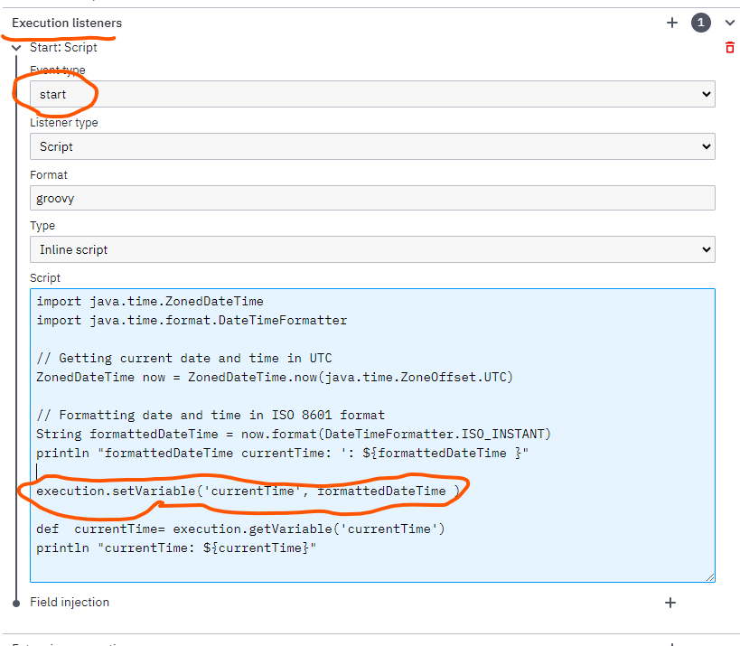
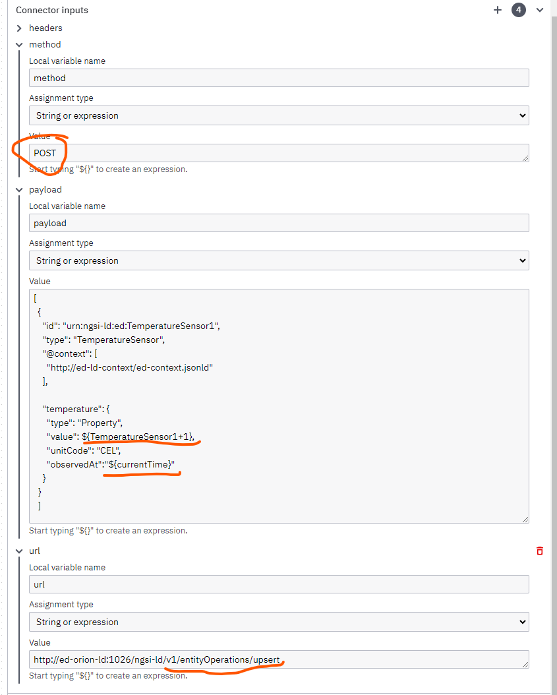

## Run example

1. Run docker with all images: ```docker compose up -d```
2. Load sensor data to Orion-LD
    - See [orionLD_Cammands.md](./orionLD_Cammands.md)  OR
    - [Postman collection](./camundaRest.postman_collection.json)
3. Open any bpmb (getData, getDataAllInOne, getDataMultipleAllInOne), deploy and run it. **IMPORTANT** On the Service task, Connector input. url you need to specify the endpoint to access the data ie http://ed-orion-ld:1026/ngsi-ld/v1/entities/urn:ngsi-ld:ed:ieq1 . On our example the Orion-LD is running on the ed-orion-ld:1026, see [docker-compose.yml](./docker-compose.yml) -> container_name
4. Open the log file of the camunda container to see the output. For "getData.bpmn" it should be like
```console
____________________________________
Keys: [id, temperature, type]
Values: [urn:ngsi-ld:ed:TemperatureSensor1, [observedAt:2023-09-16T17:06:49.000Z, type:Property, unitCode:CEL, value:10], TemperatureSensor]
Value for 'temperature': 10
____________________________________
Values TemperatureSensor1: 10
```
5. See [camunda_rest.gif](./visual/camunda_rest.gif) 


## Example simpleIf process
The process is a simple if statement to test the interaction with Orion-LD
1. Set temperature of urn:ngsi-ld:ed:TemperatureSensor1 at 50oC with command from [orionLD_Cammands.md](./orionLD_Cammands.md) or postman
2. Run the "simpleIf.bpmn" and open the instance in Camunda Cockpit
3. Raise the temperature to 1000oC by running command from [orionLD_Cammands.md](./orionLD_Cammands.md) or postman 
4. The presses finish 


## Example add 1oC Temperature process 
The process is a simple GET and POST message from/to Orion-LD
The temperature is increasing by 1oC every iteration and also the current timestamp is send

1. Set temperature of urn:ngsi-ld:ed:TemperatureSensor1 at 50oC with command from [orionLD_Cammands.md](./orionLD_Cammands.md) or postman
2. Run the "add1DegreeToTemperature.bpmn" and open the instance in Camunda Cockpit
3. Get the current temperature by running command from [orionLD_Cammands.md](./orionLD_Cammands.md) or postman 
4. The presses finish 

### Creating the "currentTime"



### Prepare the POST payload


# For CIRCULOOS project

A example .bpmn and form to request the username and password of the user, get the Bearer token and adding to the POST request for the the Orion-LD version.
See 